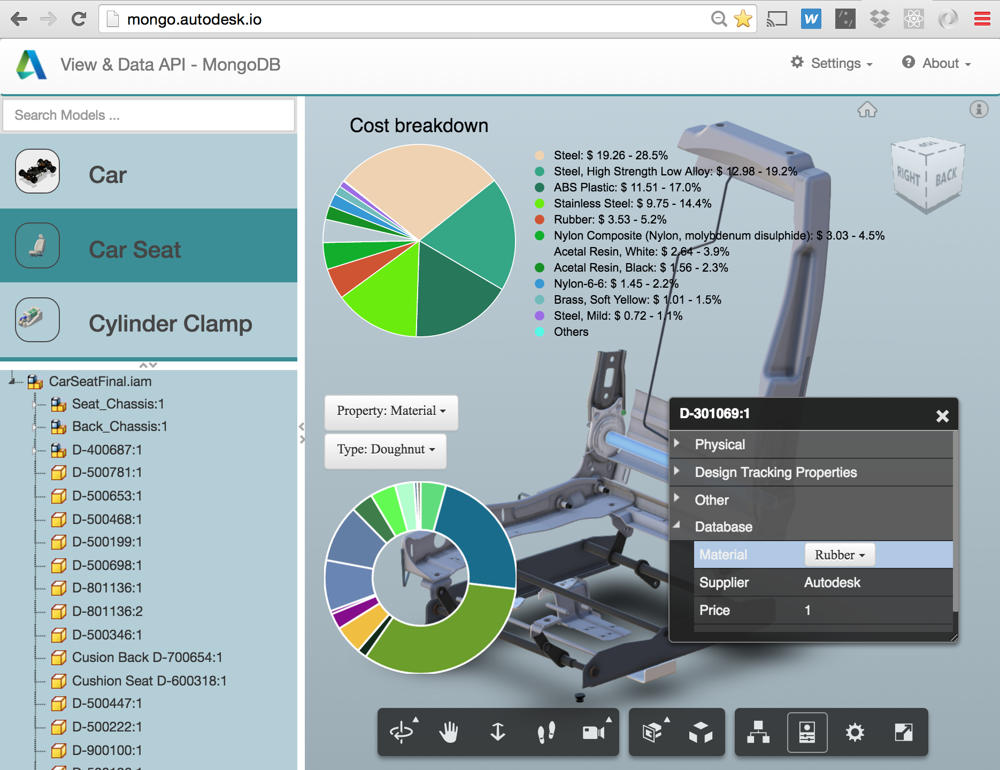
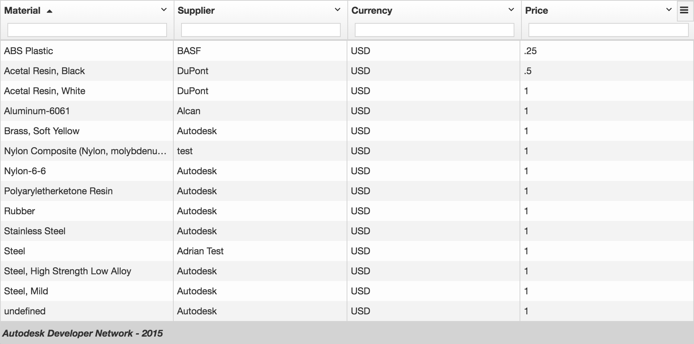

#Autodesk view and data API MongoDb Integration Sample

##Description

That sample demonstrates how to integrate MongoDb with the Autodesk View & Data API using a Node.js server and a AngularJs-based client

##Setup/Usage Instructions

* Install Node.js

* Run "npm install" command from the root directory
* You need to request API credentials at our [developer portal](https://developer.autodesk.com/user/me/apps)

* You also need credentials to access a mongoDB database or run one instance locally. This demo is using a mongoDB hosted on [mongolab](https://mongolab.com/) which provides a free tier.

* The following environment variables are used by that sample:

      DB_USER: mongoDB database User
      DB_PWD: mongoDB database Password
      DB_PORT: mongoDB database Port
      DB_HOST: mongoDB database Host
      DB_NAME: mongoDB database Name
  
      LMV_CONSUMERKEY: View & Data API CONSUMERKEY
      LMV_CONSUMERSECRET: View & Data API CONSUMERSECRET

* You will need a model with components having a property named "Material", you can use the seat.dwf model from data folder for testing.
* Upload your model using instructions from the [API documentation](http://developer.api.autodesk.com/documentation/v1/vs/vs_quick_start.html#vs-api-quick-start)
* Alternatively you can use one of our tools, for example:
  [http://models.autodesk.io](http://models.autodesk.io)

* Run the server: "node server.js" from command line
* If you run the sample locally open this url in your browser:   
 http://localhost:3000

## Live demo

[http://mongo.autodesk.io](http://mongo.autodesk.io)

## License

That samples are licensed under the terms of the [MIT License](http://opensource.org/licenses/MIT). Please see the [LICENSE](LICENSE) file for full details.

## Deploy to Heroku

Click the button below to easily deploy that sample on Heroku (requires an Heroku account)

##Written by 

Written by [Philippe Leefsma](http://adndevblog.typepad.com/cloud_and_mobile/philippe-leefsma.html)

